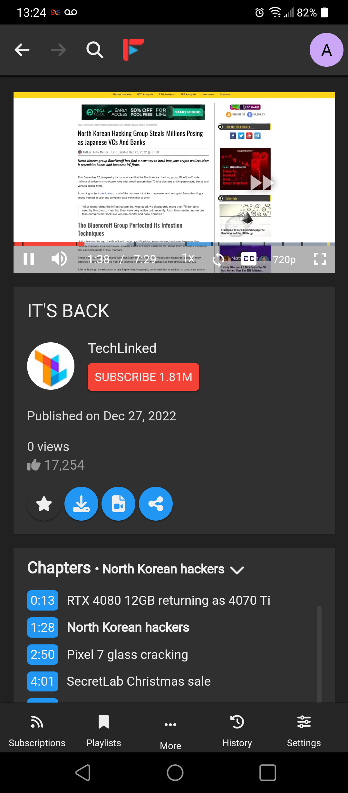

<p align="center" >
 
</p>
<h2 align='center'>
An open source YouTube player built with privacy in mind.
</h2>

<p align='center'>
  <a href='https://github.com/MarmadileManteater/FreeTubeCordova/actions/workflows/buildCordova.yml'>
    
  </a>
  <a href="https://apt.izzysoft.de/fdroid/index/apk/io.freetubeapp.freetube">
    
  </a>
<a href="https://hosted.weblate.org/engage/free-tube/">

</a>
</p>
<hr>
<p align="center"><a href="#screenshots">Screenshots</a> &bull; <a href="#how-does-it-work">How does it work?</a> &bull; <a href="#features">Features</a> &bull; <a href="#how-to-build-and-test">Building and testing</a> &bull; <a href="#contributing">Contributing</a> &bull; <a href="#localization">Localization</a> &bull; <a href="#contact">Contact</a> &bull; <a href="#upstream-donations">Donate</a> &bull; <a href="#license">License</a></p>
<p align="center"><a href="https://freetubeapp.io/">Website</a> &bull; <a href="https://blog.freetubeapp.io/">Blog</a> &bull; <a href="https://docs.freetubeapp.io/">Documentation</a> &bull; <a href="https://docs.freetubeapp.io/faq/">FAQ</a> &bull; <a href="https://github.com/FreeTubeApp/FreeTube/discussions">Discussions</a></p>
<hr>

FreeTube Cordova is an open source YouTube player built with privacy in mind. Use YouTube without advertisements and prevent Google from tracking you with their cookies and JavaScript.
Available for Android and as a PWA. FreeTube Cordova is a fork of [FreeTube](https://www.github.com/FreeTubeApp).
FreeTube Cordova is currently in Beta. While it should work well for most users, there are still bugs and missing features that need to be addressed.
<p align='center'>
  <a href='https://apt.izzysoft.de/fdroid/index/apk/io.freetubeapp.freetube'>
    
  </a>
</p>

<p align="center"><a href="https://github.com/MarmadileManteater/FreeTubeCordova/releases">Download FreeTubeCordova</a></p>

<hr>

## How does it work?
FreeTube Cordova uses the [Invidious API](https://github.com/iv-org/invidious) to serve data and videos. No official YouTube APIs are used to obtain data. Your subscriptions and history are stored locally on your device and are never sent out.

## Features
* Watch videos without ads
* Use YouTube without Google tracking you using cookies and JavaScript
* Subscribe to channels without an account
* Connect to an externally setup proxy such as Tor
* View and search your local subscriptions, history, and saved videos
* Organize your subscriptions into "Profiles" to create a more focused feed
* Export & import subscriptions
* Youtube Trending
* Youtube Chapters
* Most popular videos page based on the set Invidious instance
* SponsorBlock 
* Full Theme support
* Multiple windows
* Mini Player (Picture-in-Picture)
* Keyboard shortcuts
* Option to show only family friendly content
* Show/hide functionality or elements within the app using the distraction free settings

Go to [FreeTube's Documentation](https://docs.freetubeapp.io/) if you'd like to know more about how to operate FreeTube and its features.

## Screenshots
  

## How to install

There is a deployed PWA (progressive web app) available here:

[https://marmadilemanteater.github.io/freetube/#/](https://marmadilemanteater.github.io/freetube/#/)

There is an APK which can be downloaded here:

[https://github.com/MarmadileManteater/FreeTubeCordova/releases](https://github.com/MarmadileManteater/FreeTubeCordova/releases)

### Automated Builds (Nightly / Weekly)
Builds are automatically created from changes to our development branch via [GitHub Actions](https://github.com/MarmadileManteater/FreeTubeCordova/actions/workflows/buildCordova.yml).

The first build with a green check mark is the latest build. You will need to have a GitHub account to download these builds.

## How to build and test
### Commands for the Android APK
```bash
    # 📦 Packs the project using `webpack.cordova.config.js`
    yarn pack:cordova
    # 🏗 Builds the debug APK and launches it on a connected device
    yarn run:cordova
    # 🚧 Builds the development APK
    yarn build:cordova
    # 🏦 Builds the release APK
    yarn build:cordova --release
```
### Commands for the PWA (progressive web app)
```bash
    # 🐛 Debugs the project using `webpack.web.config.js`
    yarn dev:web
    # 📦 Packs the project using `webpack.web.config.js` 
    yarn pack:web
```
## Contributing

**NOTICE: MOST CHANGES SHOULD PROBABLY BE MADE TO [UPSTREAM](https://www.github.com/freetubeapp/freetube) UNLESS DIRECTLY RELATED TO CORDOVA CODE OR WORKFLOWS.**

If you like to get your hands dirty and want to contribute, we would love to
have your help.  Send a pull request and someone will review your code. Please
follow the [Contribution
Guidelines](https://github.com/MarmadileManteater/FreeTubeCordova/blob/development/CONTRIBUTING.md)
before sending your pull request.


## Localization
<a href="https://hosted.weblate.org/engage/free-tube/">

</a>

If you'd like to localize FreeTubeCordova, please send submissions to [FreeTube's weblate](https://hosted.weblate.org/engage/free-tube/).

## Contact
If you ever have any questions, feel free to make an issue here on GitHub. 

## Upstream Donations
If you enjoy using FreeTubeCordova, you're welcome to leave a donation using the following methods to support upstream development and maintenance.  

* [FreeTube on Liberapay](https://liberapay.com/FreeTube)

* Bitcoin Address: `1Lih7Ho5gnxb1CwPD4o59ss78pwo2T91eS`

* Monero Address: `48WyAPdjwc6VokeXACxSZCFeKEXBiYPV6GjfvBsfg4CrUJ95LLCQSfpM9pvNKy5GE5H4hNaw99P8RZyzmaU9kb1pD7kzhCB`

While your donations are much appreciated, only donate if you really want to.  Donations are used for keeping the website up and running and eventual code signing costs.

## License
[](https://www.gnu.org/licenses/agpl-3.0.html)  

FreeTube is Free Software: You can use, study share and improve it at your
will. Specifically you can redistribute and/or modify it under the terms of the
[GNU Affero General Public License](https://www.gnu.org/licenses/agpl-3.0.html) as
published by the Free Software Foundation, either version 3 of the License, or
(at your option) any later version.  
